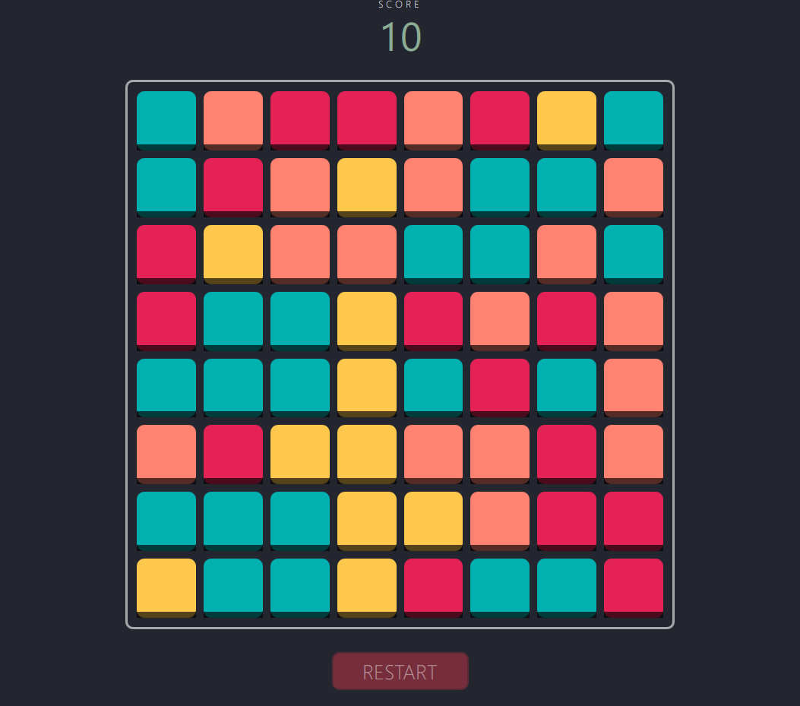

    <h1>ColorBusters Tile Game</h1>
    

        
         
        <em>A colorful short tile-based game created with the QT framework and C++.</em>
    

## :sparkles: Features

- Choose between an 8x8, 9x9, or 10x10 grid.
- Improve your score by finding 3 or more adjacent matching tiles!
- Your score will decrease over time.
- Nice animations to show whether a selected tile was valid or not.
- Creation of software adhering to best practices for Object Oriented Programming.
